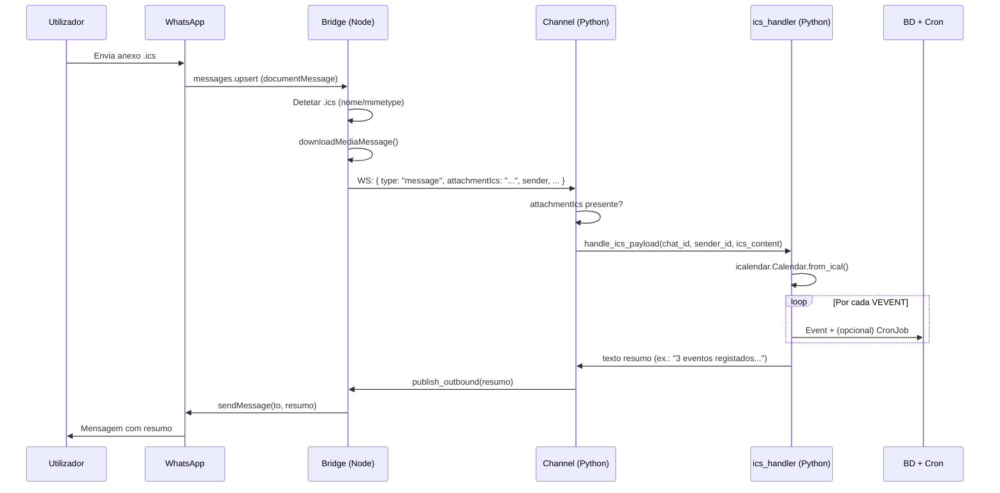

# Fluxo concreto: anexo .ics → eventos no WhatsApp

Este documento descreve o fluxo passo a passo para receber um ficheiro `.ics` no WhatsApp, interpretá-lo e criar eventos (e opcionalmente lembretes) no sistema, devolvendo um resumo ao utilizador.

---

## Diagrama do fluxo



---

## 1. Bridge (Node/TypeScript)

**Ficheiro:** `bridge/src/whatsapp.ts`

**Responsabilidade:** Detetar anexos `.ics`, fazer download do ficheiro, enviar o conteúdo no payload para o gateway.

### 1.1 Deteção de anexo .ics

- Em `messages.upsert`, além de `extractMessageContent`, verificar se existe `msg.message.documentMessage`.
- Critérios para considerar .ics:
  - `documentMessage.fileName` termina em `.ics`, ou
  - `documentMessage.mimetype === 'text/calendar'` (ou contém `calendar`).

### 1.2 Download do ficheiro

- Usar a API Baileys para obter o buffer: `sock.downloadMediaMessage(msg)` (ou equivalente no teu wrapper).
- Decodificar o buffer como UTF-8 para obter a string do .ics.
- Limitar tamanho (ex.: máx. 500 KB) para evitar payloads enormes no WebSocket.

### 1.3 Payload enviado ao gateway

Enviar **um único** objeto pelo WebSocket, no mesmo formato de mensagem de texto, com um campo extra:

```ts
{
  type: 'message',
  id: msg.key.id || '',
  sender: msg.key.remoteJid || '',
  pn: msg.key.remoteJidAlt || '',
  content: '[Calendar]',  // texto curto para logs; o conteúdo real está em attachmentIcs
  timestamp: msg.messageTimestamp,
  isGroup: false,
  attachmentIcs: '<conteúdo bruto do ficheiro .ics em string UTF-8>'
}
```

- Se o download falhar ou o ficheiro for vazio/inválido, **não** enviar `attachmentIcs`; opcionalmente enviar uma mensagem normal com `content: '[Document .ics - falha ao transferir]'` para o utilizador receber feedback no gateway (ou ignorar).

### 1.4 Interface TypeScript

- Alargar `InboundMessage` em `whatsapp.ts`:

```ts
export interface InboundMessage {
  id: string;
  sender: string;
  pn: string;
  content: string;
  timestamp: number;
  isGroup: boolean;
  attachmentIcs?: string;  // opcional; presente quando o anexo era .ics
}
```

- Em `extractMessageContent`, não devolver nada para mensagens que forem *só* documento .ics (sem caption), para que o fluxo use apenas `attachmentIcs`. Se houver caption, pode usar-se como `content` e enviar também `attachmentIcs`.

---

## 2. Canal WhatsApp (Python)

**Ficheiro:** `zapista/channels/whatsapp.py`

**Responsabilidade:** Reconhecer mensagens com `.ics`, chamar o handler e responder ao utilizador sem passar pelo agente.

### 2.1 Tratamento em `_handle_bridge_message`

Ordem sugerida (após dedup e filtro de grupos):

1. Se `data.get("attachmentIcs")` existir e for uma string não vazia:
   - Extrair `sender`, `sender_id` (como já fazes para mensagens normais).
   - Chamar `handle_ics_payload(chat_id=sender, sender_id=sender_id, ics_content=data["attachmentIcs"])` (função no backend; ver secção 3).
   - Enviar a resposta ao utilizador com `publish_outbound(OutboundMessage(channel="whatsapp", chat_id=sender, content=resposta))`.
   - Fazer `return` (não publicar no bus nem passar ao agente).

2. Caso contrário, seguir o fluxo atual (God Mode, depois `_handle_message` para o agente).

### 2.2 Dependências

- O canal não precisa do cron nem da BD diretamente; apenas chama o handler que devolve texto. O handler é que usa `SessionLocal`, `CronService`/`CronTool` (se estiverem disponíveis via parâmetros ou injeção).

---

## 3. Handler .ics (Backend Python)

**Ficheiro (sugestão):** `backend/ics_handler.py`

**Responsabilidade:** Parse do .ics, criação de eventos (e opcionalmente jobs de lembrete), e geração do texto de resumo.

### 3.1 Assinatura

```python
def handle_ics_payload(
    chat_id: str,
    sender_id: str,
    ics_content: str,
    *,
    db_session_factory,
    cron_service: Optional[CronService] = None,
    cron_tool: Optional[CronTool] = None,
    user_lang: str = "en",
) -> str:
    """Parse .ics, persiste eventos (e opcionalmente lembretes). Retorna mensagem de resumo para o utilizador."""
```

- `db_session_factory`: por exemplo `SessionLocal` do `backend.database`.
- `cron_service` / `cron_tool`: opcionais; se fornecidos, podem ser usados para criar um lembrete X minutos antes de cada evento (ex.: 15 min antes).
- `user_lang`: para localizar a mensagem de resumo (pt-PT, pt-BR, es, en).

### 3.2 Parse com icalendar

```python
import icalendar

cal = icalendar.Calendar.from_ical(ics_content)
if cal is None:
    return "Calendário inválido. Envia um ficheiro .ics válido."
```

- Iterar `cal.walk()` e filtrar apenas `component.name == "VEVENT"`.
- Para cada VEVENT, extrair (com fallbacks):
  - `summary` → nome do evento
  - `dtstart` / `dtend` → início/fim (suportar date e datetime)
  - `description`, `location`, `url` (se existirem)

### 3.3 Persistência

- Obter utilizador: `user = get_or_create_user(db, chat_id)` (usar `chat_id` como identificador, como no resto do sistema).
- Para cada VEVENT (com limite, ex.: máx. 50 eventos por .ics):
  - **Event (BD):**  
    `Event(user_id=user.id, tipo="evento", payload={ "nome": summary, "data": iso_inicio, "data_fim": iso_fim, "descricao": desc, "local": location, "url": url }, data_at=dtstart_datetime, deleted=False)`  
  - **Lembrete (opcional):** se `cron_tool` e `dtstart` for datetime no futuro, chamar `cron_tool.set_context("whatsapp", chat_id)` e `cron_tool.execute(action="add", message=f"Lembrete: {summary}", in_seconds=...)` com `in_seconds = (dtstart - now).total_seconds() - 900` (15 min antes), respeitando um mínimo (ex.: 60 s) e máximo (ex.: 30 dias).

### 3.4 Resposta ao utilizador

- Construir uma mensagem curta, por exemplo:
  - "Encontrados N eventos no calendário. Registados no teu organizador."
  - Listar os primeiros 3–5 com nome e data/hora (formato curto, ex.: «Reunião X» dia 15/02 às 14:00).
  - Se tiveres criado lembretes: "Vou lembrar-te 15 min antes de cada um."
- Usar `user_lang` para escolher frases em pt-PT, pt-BR, es ou en (pode usar o mesmo padrão de `backend.locale`).

### 3.5 Erros e limites

- Ficheiro demasiado grande (ex.: > 500 KB): rejeitar no bridge; no Python, se receberes strings muito longas, truncar ou devolver "Ficheiro demasiado grande."
- Parse falhado: devolver "Calendário inválido. Envia um ficheiro .ics válido."
- Zero VEVENTs: "Nenhum evento encontrado neste calendário."
- Não expor stack traces ao utilizador; logar exceções no servidor.

---

## 4. Integração no gateway (quem chama o handler)

O gateway (ex.: `zapista/cli/commands.py` ou o ponto onde o canal WhatsApp é criado) precisa de ter acesso a:

- `SessionLocal` (já existe em `backend.database`)
- `CronService` e `CronTool` (já existem quando corres `Zapista gateway`)

O canal WhatsApp **não** tem referência ao cron por defeito. Duas opções:

**A) Passar dependências ao canal**  
- No construtor do `WhatsAppChannel` (ou no `run` do gateway), passar `cron_service` e `cron_tool` (e talvez `db_session_factory`) para o canal, e o canal passa-os a `handle_ics_payload`.  
- Vantagem: tudo no mesmo sítio.  
- Desvantagem: o canal fica a saber de cron/DB.

**B) O canal só envia o texto do .ics para o bus e um “worker” trata**  
- O canal publica uma mensagem interna com `content` = texto do .ics e um metadata `attachment_ics: True` (ou tipo especial). Um consumidor (no mesmo processo do gateway) chama `handle_ics_payload` e depois `publish_outbound` com o resumo.  
- Mais desacoplado, mas exige um tipo de mensagem “ics” no bus e um handler específico.

Recomendação para manter o fluxo simples: **opção A** — no arranque do gateway, instanciar o handler (ou o módulo ics_handler) com `db_session_factory`, `cron_service` e `cron_tool`, e passar essa função (ou um pequeno wrapper) ao canal WhatsApp para ele chamar quando receber `attachmentIcs`. O canal continua a ser o único a decidir “isto é .ics” e “vou responder com este texto”, sem expor o bus a um novo tipo de evento.

---

## 5. Resumo dos ficheiros a tocar/criar

| Camada      | Ficheiro                 | Alteração |
|------------|---------------------------|-----------|
| Bridge     | `bridge/src/whatsapp.ts`  | Detetar documento .ics, download, adicionar `attachmentIcs` ao payload; alargar `InboundMessage`. |
| Bridge     | `bridge/src/types.d.ts` (se existir) | Incluir `attachmentIcs?: string` no tipo da mensagem. |
| Canal      | `zapista/channels/whatsapp.py` | Se `attachmentIcs` presente, chamar handler e `publish_outbound(resumo)`; não enviar ao agente. |
| Backend    | `backend/ics_handler.py` (novo) | `handle_ics_payload(...)`: parse icalendar, Event + opcional cron, texto resumo. |
| Gateway    | `zapista/cli/commands.py` (ou onde o canal é criado) | Instanciar/obter handler com DB + cron e passar ao canal (ou injetar no canal). |
| Deps       | `pyproject.toml`         | Adicionar `icalendar`. |

---

## 6. Exemplo de payload Bridge → Gateway (com .ics)

```json
{
  "type": "message",
  "id": "3EB0XXXX",
  "sender": "351912345678@s.whatsapp.net",
  "pn": "",
  "content": "[Calendar]",
  "timestamp": 1739123456,
  "isGroup": false,
  "attachmentIcs": "BEGIN:VCALENDAR\r\nVERSION:2.0\r\nPRODID:-//Example//EN\r\nBEGIN:VEVENT\r\nSUMMARY:Reunião X\r\nDTSTART:20250215T140000Z\r\nDTEND:20250215T150000Z\r\nEND:VEVENT\r\nEND:VCALENDAR"
}
```

O canal vê `attachmentIcs`, chama `handle_ics_payload(sender, sender_id, ics_content)`, obtém algo como “1 evento registado: «Reunião X» 15/02 às 14:00. Vou lembrar-te 15 min antes.” e envia essa string ao utilizador via `publish_outbound`.

---

## 7. Próximos passos de implementação

1. **Bridge:** implementar deteção de .ics, `downloadMediaMessage`, e campo `attachmentIcs` no payload (e atualizar tipos).
2. **Backend:** criar `backend/ics_handler.py` com parse icalendar, criação de Event (+ opcional cron) e mensagem de resumo.
3. **Canal:** em `whatsapp.py`, tratar `attachmentIcs` e chamar o handler; enviar resposta com `publish_outbound`.
4. **Gateway:** passar `db_session_factory`, `cron_service` e `cron_tool` ao canal (ou a um wrapper do handler) para o handler poder criar eventos e lembretes.
5. **Testes:** teste unitário com um .ics de exemplo em `handle_ics_payload`; teste de integração bridge → canal com payload mock com `attachmentIcs`.

Com este fluxo, o caminho “anexo .ics no WhatsApp → eventos e lembretes no sistema → resposta no chat” fica definido de forma concreta e implementável.
